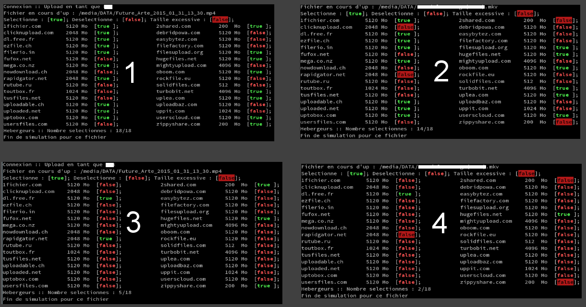

        Multiup MaNaGer CLI v0.4.1 - Copyright 2013-2015 Lex - Welcome !

            For more advanced features,
            please go to "Multiup MaNaGer GUI",
            which is available on the website...

    Syntax:
    ./multiup-cli [options...] --read ["file" "file"...] --hosts ["host" "host"...] [2>links.txt]

    Options:
            --login <nom> --password <password>
            --view          Simulation of the upload (verification of the parameters).
            --hosts         Specify a personal list of hosts.
            --output        Write links in a specified text file.
            [2>liens.txt]   Redirect links from stderr to a specific file.

multiup-cli is a command line tool for sending files on www.multiup.org.

Features:

* Upload simulation
* Automatic selection of the hosts according to the size of the files
* Ability to manually select a list of hosts
* Multiplatform (Raspberry pi, GNU/Linux, Windows)

# Tutorial

In the examples, two files were tested: one of 190Mo, the other 2,8Go.
--view option is used to simulate the upload (just a description of the
behavior of the software when the files should be really uploaded).

Command of examples 1 et 2:

    multiup-cli --login xxx --password yyy --read "Future_Arte_2015_01_31_13_30.mp4" "big_file.mkv" --view

Command of examples 3 et 4:

    multiup-cli --login xxx --password yyy --read "Future_Arte_2015_01_31_13_30.mp4" "big_file.mkv" \
    --hosts 2shared.com dl.free.fr rapidgator.net "hugefiles.net" zippyshare.com --view

In examples 1 and 2, only the hosts selected by default on the site are taken into account.
In example 2, the program informs us that the file we're ready to upload will not be sent
on 4 hosts (larger than the authorized limit), so 14 hosts out of 18 will be used.

In examples 3 and 4, a list of 5 hosts (out of 18 allowed) were manually specified;
again, in example 4, the file is too big for 3 of them.

By removing --view option, the files will be really sent.

To retrieve only the links for each file, append the following instruction to your previous command:

    command 2> links.txt

Note: This feature will be improved in the near future.

# Compilation

## Windows : Microsoft visual studio

Via the command line:

    mkdir build
    cd build
    cmake .. -G "NMake Makefiles"
    nmake

Via the gui of the IDE:

    mkdir build
    cd build
    cmake .. -G "Visual Studio 10"

Then, open the `.sln` file in `build` folder.
Next, compile in **Release** mode.

If you want to compile in **Debug** mode, open the project's settings and then
search in **linker** section:

`Entrée / "bibliothèques par défaut spécifiques ignorées"` : `msvcrt.lib`
`LINK : warning LNK4098: conflit entre la bibliothèque par défaut 'MSVCRT' et les autres bibliothèques ; utilisez /NODEFAULTLIB:library`

## Windows : QtCreator

Open the file `multiup.pro` or run the following command:

    qmake multiup.pro
    mingw32-make

## Linux/GNU

You will have to install the following system package (or similar):

    libcurl4-gnutls-dev

Then run:

    mkdir build
    cd build
    cmake ..
    make -j 4

Then if you want to compile the **deb** package for Debian or Ubuntu,
run the following command:

    cpack

You will find the executable `multiup-cli` and the deb package `multiup-cli_x.x.x.deb`.

# License

multiup-cli is free software: you can redistribute it and/or modify
it under the terms of the GNU General Public License as published by
the Free Software Foundation, either version 3 of the License, or
(at your option) any later version.

multiup-cli is distributed in the hope that it will be useful,
but WITHOUT ANY WARRANTY; without even the implied warranty of
MERCHANTABILITY or FITNESS FOR A PARTICULAR PURPOSE.  See the
GNU General Public License for more details.
